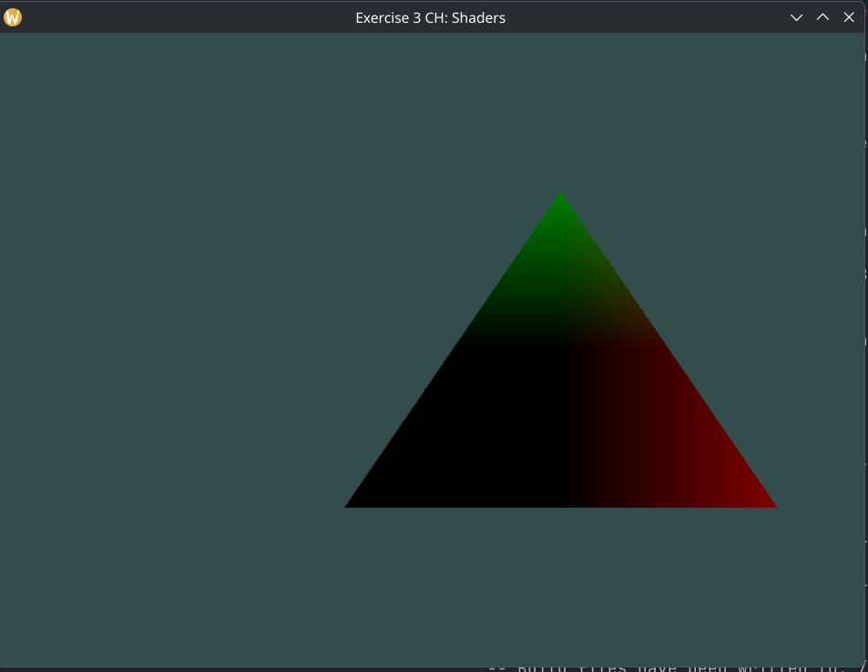

## CH:Shaders

#### Exercise 3:

- `Output the vertex position to the fragment shader using the out keyword and set the fragment's color equal to this vertex position (see how even the vertex position values are interpolated across the triangle). Once you managed to do this; try to answer the following question: why is the bottom-left side of our triangle black?`

