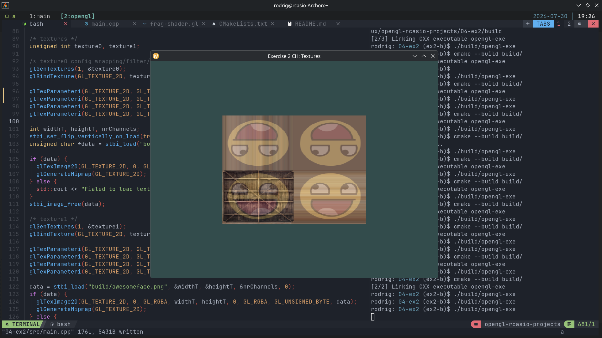
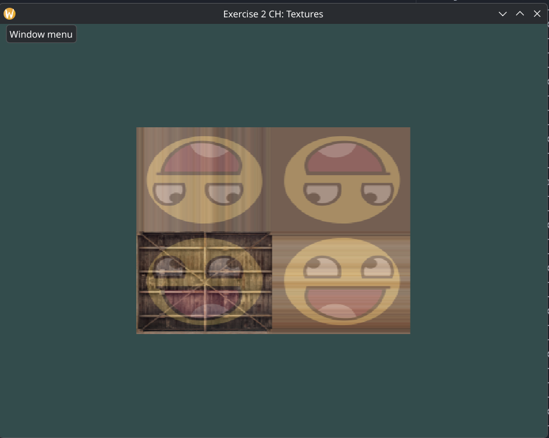
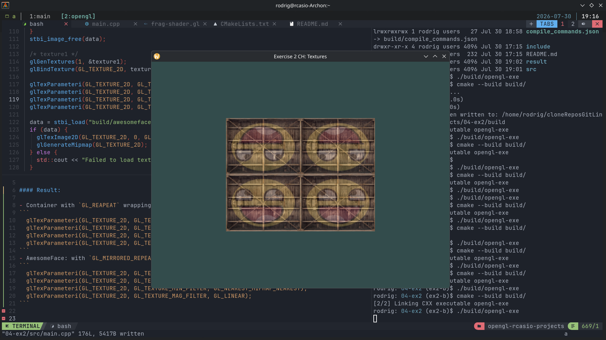
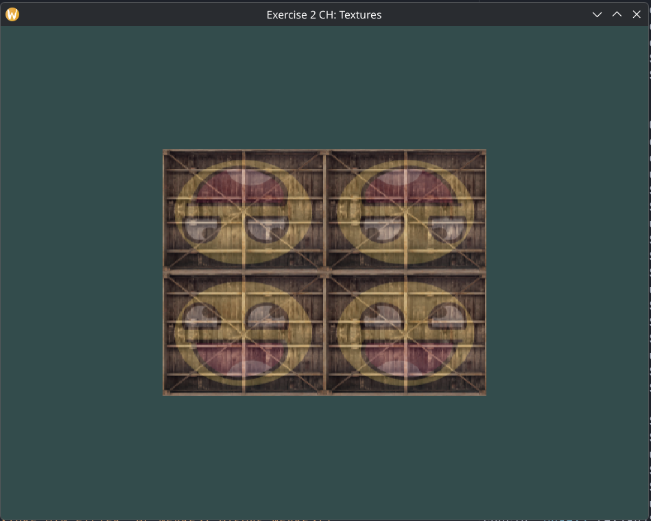

### Exercise 2 CH: Textures

- `Experiment with the different texture wrapping methods by specifying texture coordinates in the range 0.0f to 2.0f instead of 0.0f to 1.0f. See if you can display 4 smiley faces on a single container image clamped at its edge`  
- `See if you can experiment with other wrapping methods as well.`

#### Results:


#### 1: 

- vertex data (with increased texture coordinates from the default range to visualize wrapping methods behaviour)
```
    // two triangles drawn (rectangle)
    /* Positions */         /* Colors */        /* texture coords */
    /* x     y    z */    /* R      G     B */  /*S    T */
    0.5f,  0.5f, 0.0f,      1.0f, 0.0f, 0.0f,   2.0f, 2.0f,   // top right  (0)
    0.5f, -0.5f, 0.0f,      0.0f, 1.0f, 0.0f,   2.0f, 0.0f,   // bottom right (1)
   -0.5f, -0.5f, 0.0f,      0.0f, 0.0f, 1.0f,   0.0f, 0.0f,   // bottom left  (2)
   -0.5f,  0.5f, 0.0f,      0.0f, 0.0f, 0.0f,   0.0f, 2.0f,   // top left (3)
  };
```

- Container with `GL_CLAMP_TO_EDGE` wrapping
```

  /* texture0 */
  glGenTextures(1, &texture0);
  glBindTexture(GL_TEXTURE_2D, texture0);

  glTexParameteri(GL_TEXTURE_2D, GL_TEXTURE_WRAP_S, GL_CLAMP_TO_EDGE);
  glTexParameteri(GL_TEXTURE_2D, GL_TEXTURE_WRAP_T, GL_CLAMP_TO_EDGE);
  glTexParameteri(GL_TEXTURE_2D, GL_TEXTURE_MIN_FILTER, GL_NEAREST_MIPMAP_NEAREST);
  glTexParameteri(GL_TEXTURE_2D, GL_TEXTURE_MAG_FILTER, GL_LINEAR);

```
- AwesomeFace: with `GL_MIRRORED_REPEAT` wrapping

```
  /* texture1 */
  glGenTextures(1, &texture1);
  glBindTexture(GL_TEXTURE_2D, texture1);

  glTexParameteri(GL_TEXTURE_2D, GL_TEXTURE_WRAP_S, GL_MIRRORED_REPEAT);
  glTexParameteri(GL_TEXTURE_2D, GL_TEXTURE_WRAP_T, GL_MIRRORED_REPEAT);
  glTexParameteri(GL_TEXTURE_2D, GL_TEXTURE_MIN_FILTER, GL_NEAREST_MIPMAP_NEAREST);
  glTexParameteri(GL_TEXTURE_2D, GL_TEXTURE_MAG_FILTER, GL_LINEAR);
```





##### 2:
- Container with `GL_REAPEAT` wrapping
```
  glTexParameteri(GL_TEXTURE_2D, GL_TEXTURE_WRAP_S, GL_REPEAT);
  glTexParameteri(GL_TEXTURE_2D, GL_TEXTURE_WRAP_T, GL_REPEAT);
  glTexParameteri(GL_TEXTURE_2D, GL_TEXTURE_MIN_FILTER, GL_NEAREST_MIPMAP_NEAREST);
  glTexParameteri(GL_TEXTURE_2D, GL_TEXTURE_MAG_FILTER, GL_LINEAR);
```
- AwesomeFace: with `GL_MIRRORED_REPEAT` wrapping
```
  glTexParameteri(GL_TEXTURE_2D, GL_TEXTURE_WRAP_S, GL_MIRRORED_REPEAT);
  glTexParameteri(GL_TEXTURE_2D, GL_TEXTURE_WRAP_T, GL_MIRRORED_REPEAT);
  glTexParameteri(GL_TEXTURE_2D, GL_TEXTURE_MIN_FILTER, GL_NEAREST_MIPMAP_NEAREST);
  glTexParameteri(GL_TEXTURE_2D, GL_TEXTURE_MAG_FILTER, GL_LINEAR);
```





