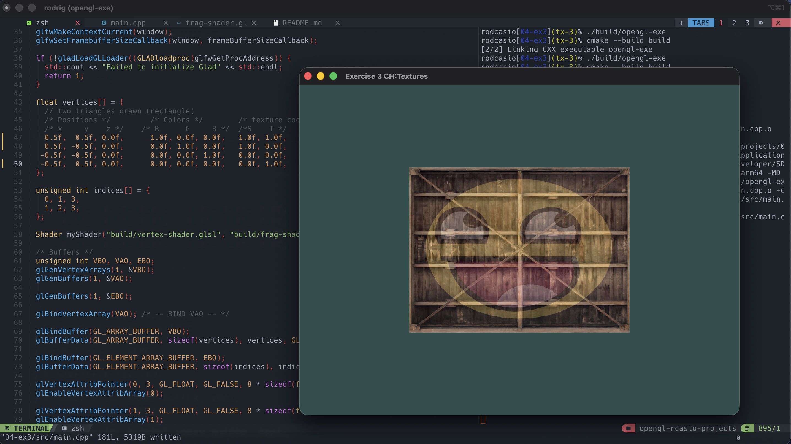
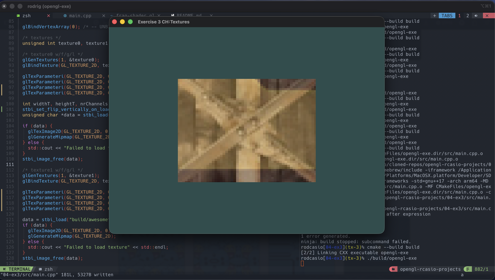

### Exercise 3 CH: Textures

- `Try to display only the center pixels of the texture image on the rectangle in such a way that the individual pixels are getting visible by changing the texture coordinates. Try to set the texture filtering method to GL_NEAREST to see the pixels more clearly:`

#### Result:

- Default range for tex coordinates (0.0 - 1.0)
```
  float vertices[] = {
    // two triangles drawn (rectangle)
    /* Positions */         /* Colors */        /* texture coords (default range) */
    /* x     y    z */    /* R      G     B */  /*S    T */
    0.5f,  0.5f, 0.0f,      1.0f, 0.0f, 0.0f,   1.0f, 1.0f,   // top right  (0)
    0.5f, -0.5f, 0.0f,      0.0f, 1.0f, 0.0f,   1.0f, 0.0f,   // bottom right (1)
   -0.5f, -0.5f, 0.0f,      0.0f, 0.0f, 1.0f,   0.0f, 0.0f,   // bottom left  (2)
   -0.5f,  0.5f, 0.0f,      0.0f, 0.0f, 0.0f,   0.0f, 1.0f,   // top left (3)
  };
```
= 


- Zooming in on our texture image by changing text coordinates
```
  float vertices[] = {
    // two triangles drawn (rectangle)
    /* Positions */         /* Colors */        /* texture coords (changed to zoom in texture image) */
    /* x     y    z */    /* R      G     B */  /*S    T */
    0.5f,  0.5f, 0.0f,      1.0f, 0.0f, 0.0f,   0.55f, 0.55f,   // top right  (0)
    0.5f, -0.5f, 0.0f,      0.0f, 1.0f, 0.0f,   0.55f, 0.45f,   // bottom right (1)
   -0.5f, -0.5f, 0.0f,      0.0f, 0.0f, 1.0f,   0.45f, 0.45f,   // bottom left  (2)
   -0.5f,  0.5f, 0.0f,      0.0f, 0.0f, 0.0f,   0.45f, 0.55f,   // top left (3)
  };

```
=


