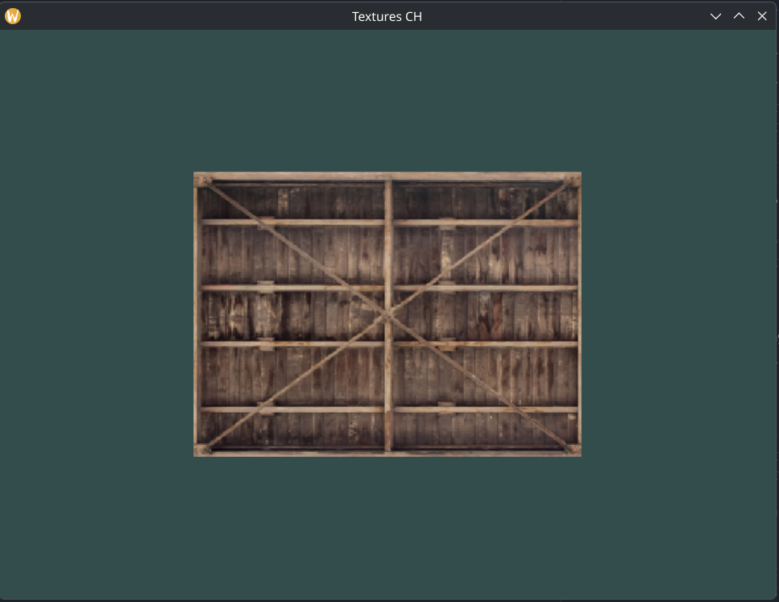
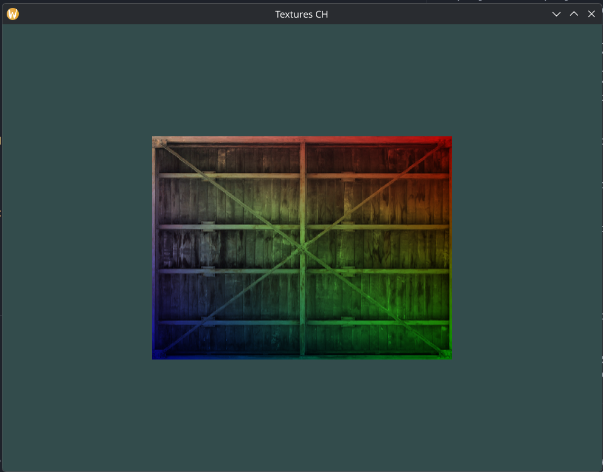
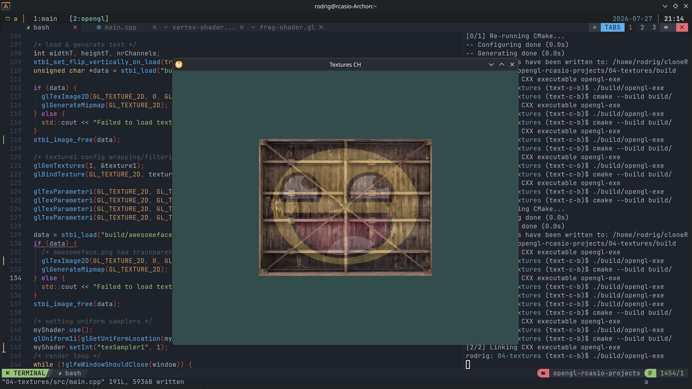
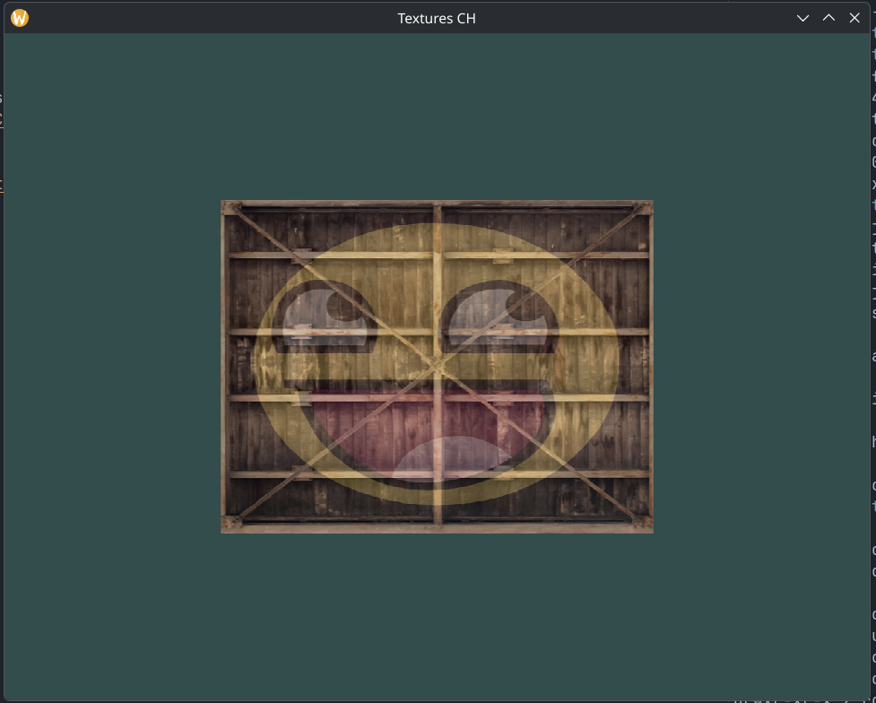

### Textures 

- First texture loaded

- mixing up output from the fragment shader, with using the color of the vertex attribute

- loaded a new texture and mixed from the first texture, using sampler and texture units, allowing to use  more than 1 texture in our shaders.

