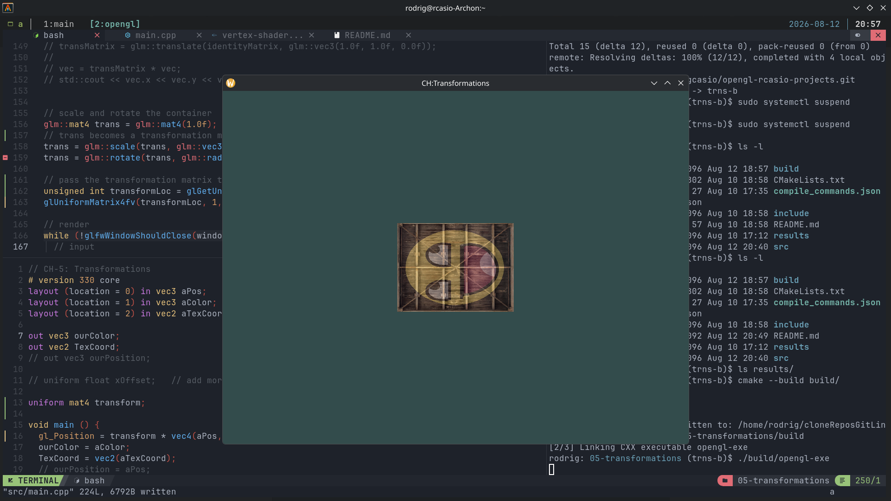

### Transformations CH

- Added glm `OpenGL Mathematics`

1. Created a transformation matrix, declared a uniform in the vertex shader and sent the matrix to the shaders where we transform our vertex coordinates

- main.cpp

`First we scale the container by 0.5 on each axis and then rotate the container 90 degrees around the Z-axis. GLM expects its angles in radians so we convert the degrees to radians using glm::radians. Note that the textured rectangle is on the XY plane so we want to rotate around the Z-axis. Keep in mind that the axis that we rotate around should be a unit vector, so be sure to normalize the vector first if you're not rotating around the X, Y, or Z axis. Because we pass the matrix to each of GLM's functions, GLM automatically multiples the matrices together, resulting in a transformation matrix that combines all the transformations.` learnopengl

```cpp
  // scale and rotate the container
  glm::mat4 trans = glm::mat4(1.0f);
  // trans becomes a transformation matrix that combines all the transformations
  trans = glm::scale(trans, glm::vec3(0.5, 0.5, 0.5));
  trans = glm::rotate(trans, glm::radians(90.0f), glm::vec3(0.0, 0.0, 1.0));
```


`We first query the location of the uniform variable and then send the matrix data to the shaders using glUniform with Matrix4fv as its postfix. The first argument should be familiar by now which is the uniform's location. The second argument tells OpenGL how many matrices we'd like to send, which is 1. The third argument asks us if we want to transpose our matrix, that is to swap the columns and rows. OpenGL developers often use an internal matrix layout called column-major ordering which is the default matrix layout in GLM so there is no need to transpose the matrices; we can keep it at GL_FALSE. The last parameter is the actual matrix data, but GLM stores their matrices' data in a way that doesn't always match OpenGL's expectations so we first convert the data with GLM's built-in function value_ptr.` learnopengl

```cpp
  // pass the transformation matrix to shader
  unsigned int transformLoc = glGetUniformLocation(myShader.ID, "transform");
  glUniformMatrix4fv(transformLoc, 1, GL_FALSE, glm::value_ptr(trans));
```

- within the vertex-shader.glsl


```glsl
# version 330 core
layout (location = 0) in vec3 aPos;
layout (location = 1) in vec3 aColor;
layout (location = 2) in vec2 aTexCoord;

out vec3 ourColor;
out vec2 TexCoord;
// out vec3 ourPosition;

// uniform float xOffset;   // add more value (0.3f set up in main()) to aPos.x

uniform mat4 transform;

void main () {
  gl_Position = transform * vec4(aPos, 1.0); 
  ourColor = aColor;
  TexCoord = vec2(aTexCoord);
  // ourPosition = aPos;
}
```
=



2. Rotate the container over time, and reposition the container at the bottom-right side of the window. `To rotate the container over time we have to update the transformation matrix in the render loop becuase it needs to update each frame`

- IMPORTANT for gl::translate() ::rotate()

-`"Remember that the actual transformation order should be read in reverse: even though in code we first translate and then later rotate, the actual transformations first apply a rotation and then a translation." learnopengl`

- within the render loop. `vertex-shader.glsl` stays with same config
```cpp

  // render
  while (!glfwWindowShouldClose(window)) {
    // input
    processInput(window);
    
    // render window
    glClearColor(0.2f, 0.3f, 0.3f, 1.0f);
    glClear(GL_COLOR_BUFFER_BIT);

    // program 
    myShader.use();

    // textures 
    glActiveTexture(GL_TEXTURE0);
    glBindTexture(GL_TEXTURE_2D, texture0);

    glActiveTexture(GL_TEXTURE1);
    glBindTexture(GL_TEXTURE_2D, texture1);
    
    // set up uniform value 
    // glUniform1f(glGetUniformLocation(myShader.ID, "mixThirdArg"), MIX_VALUE);
    myShader.setFloat("mixThirdArg", MIX_VALUE);

    // draw
    glBindVertexArray(VAO);
    glDrawElements(GL_TRIANGLES, 6, GL_UNSIGNED_INT, 0);
    
    // transformation matrix rotating container overtime
    glm::mat4 trans = glm::mat4(1.0f);
    trans = glm::translate(trans, glm::vec3(0.5f, -0.5f, 0.0f));
    trans = glm::rotate(trans, (float)glfwGetTime(), glm::vec3(0.0f, 0.0f, 1.0f));
    
    // pass the transformation matrix to shader
    unsigned int transformLoc = glGetUniformLocation(myShader.ID, "transform");
    glUniformMatrix4fv(transformLoc, 1, GL_FALSE, glm::value_ptr(trans));

    glfwSwapBuffers(window);
    glfwPollEvents();
  }

```
=


